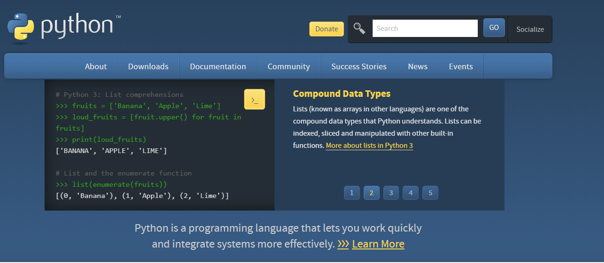
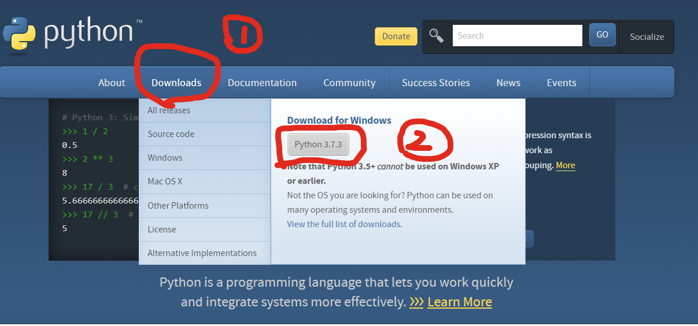
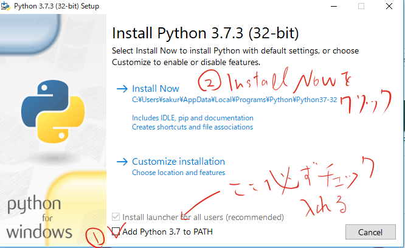
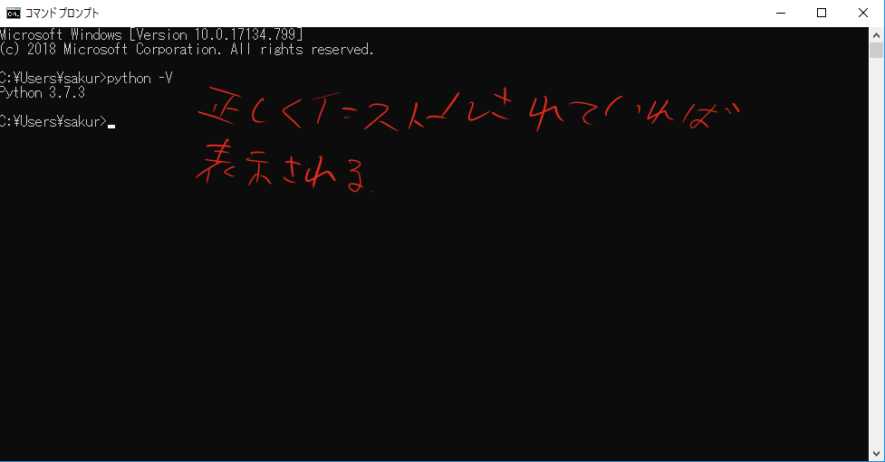

# 第一回 Python導入

---

## Mac編

---
Macではpyenvというものを使ってPythonをインストールします.
別に直接入れてもいいんですけど、バージョンを自由に切り替えれるのでこちらを採用します.
---?code=mac_install.sh
実行するコード一覧

---?code=mac_install.sh
@[1](xcodeツールのインストール.これ以降の作業を実行するために必要です.英語のポップアップが表示されますが、基本的にAgreeを選択していればOKです.)
@[2](Homebrewというツールのダウンロード.Homebrewとは、色んなツールをダウンロードするためのツールで、これさえあれば大抵の機能は追加できる.)
@[3](brewが入ってるかどうかの確認.brewのバージョンが表示される)
@[4](brewを使って、pyenvをインストール.pyenvとは、pythonのバージョン管理ツール.)
@[5](pyenvが入っていれば、バージョンが表示される)
@[6-9](~/.bash_profileにpathを書き込む.zshを使っている人は~/.zshrcに書き込む.sourceコマンドは.bashrcの再読み込みに必要)
@[10](pyenvでインストール可能なバージョンがすべて表示される.3.7.0があることを確認する.)
@[11](MacOSのMojaveではxcodeの一部のバグでpyenvが正常に動かないのでこれを実行)
@[12](これで、python3.7,0をインストールする)
@[13](インストールされているかの確認)
@[14](どこでもpython3.7.0が使えるように設定.)
@[15](3.7.0と表示されるかどうかの確認.)

---

## Win編

---

WindowsではMacとは違って公式ホームページからpythonをDLします.
Windowsはバージョン切り替えのツールの貧弱性から基本pythonの最新バージョンを手動で更新していく形がいいと思います.

---
[ここ](https://www.python.org/)からpythonの公式サイトに飛んでください.

---

図のようにクリックしたら、ダウンロードが開始します.

---

図のようにクリック

---

windowsキーを押して、cndと入力してコマンドプロントを開く.

